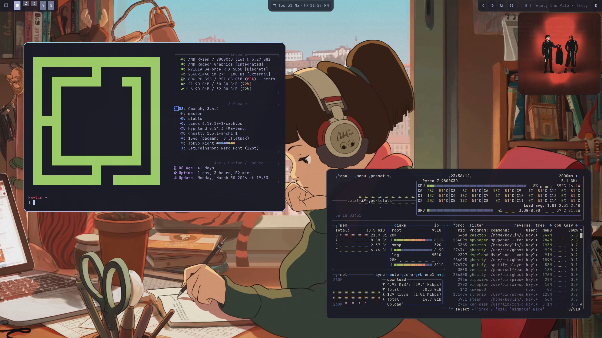
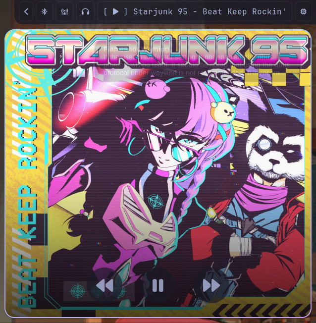

<h1 align="center">
  <br>
  <code>~/.config</code>
  <br>
</h1>

<p align="center">
  <b>kaylin's dotfiles</b> — hyprland rice on arch, tuned for daily use.
</p>

<p align="center">
  
  
  
  
</p>

<p align="center">
  
</p>

---

## What's Inside

```
.config/
├── hypr/              # hyprland wm — bindings, layout, look & feel
│   ├── hyprland.conf        main config, sources everything below
│   ├── bindings.conf        keybinds
│   ├── looknfeel.conf       borders, rounding, gaps
│   ├── monitors.conf        display setup (2560×1440 @ 180hz)
│   ├── input.conf           keyboard & touchpad
│   ├── autostart.conf       startup apps
│   ├── hypridle.conf        idle/lock timeouts
│   ├── hyprlock.conf        lock screen entry point (sources hyprlock-hyde.conf)
│   ├── hyprlock-hyde.conf   HyDE layout wrapper — vars + theme colors
│   ├── hyprlock-local.conf  per-machine overrides (gitignored; see .example)
│   ├── hyprlock/HyDE.conf   HyDE lock screen layout (vendored)
│   ├── userprefs.conf       personal tweaks — touchpad, hyprtasking, windowrules
│   └── ...
├── waybar/            # status bar — custom styling + album art popup
│   ├── config.jsonc         modules & layout
│   ├── style.css            rounded containers, hover glow
│   └── scripts/             album art toggle & live updater
├── ghostty/           # terminal emulator
├── walker/            # app launcher
├── waypaper/          # wallpaper manager (mpvpaper backend)
└── btop/              # system monitor
```

## Highlights

- **Rounded everything** — 18px corners on windows, bar modules, and launcher
- **Gradient borders** — ice blue `#89dceb` → lavender `#b4befe` → mauve `#cba6f7` at 45°
- **Waybar styling** — semi-transparent pill modules with subtle borders and smooth hover transitions
- **Video wallpapers** — via mpvpaper, persisted across reboots with waypaper
- **Album art popup** — right-click the now-playing module to toggle a pinned album art window with playback controls on hover, high-res art from MusicBrainz, and live track updates. Resizable and tileable for mini-player use.
- **Workspace overview** — `SUPER+TAB` triggers [hyprtasking](https://github.com/raybbian/hyprtasking) for an exposé-style linear overview, click-to-switch, with mauve borders matching the rest of the palette.

<p align="center">
  
</p>

## Setup

```bash
git clone git@github.com:kaylincoded/dotfiles.git
```

Copy what you need into `~/.config/`. These configs assume:

- [Hyprland](https://hyprland.org) as the compositor
- [Waybar](https://github.com/Alexays/Waybar) for the bar
- [Ghostty](https://ghostty.org) as the terminal
- [Walker](https://github.com/abenz1267/walker) as the launcher
- [waypaper](https://github.com/anufrievroman/waypaper) + [mpvpaper](https://github.com/GhostNaN/mpvpaper) for wallpapers
- [playerctl](https://github.com/altdesktop/playerctl) for the album art scripts
- [JetBrainsMono Nerd Font](https://www.nerdfonts.com/)
- An [omarchy](https://omarchy.com) base install (theme colors, menu scripts)
- [HyDE](https://github.com/HyDE-Project/HyDE) installed for the lock screen layout fragment, `hyde-shell` volume control, the screenshot pipeline (`hyde-shell screenshot` → grimblast → satty), and related scripts under `~/.local/lib/hyde/`
- [satty](https://github.com/gabm/satty) for screenshot annotation (HyDE picks it up automatically if installed)
- [hyprtasking](https://github.com/raybbian/hyprtasking) Hyprland plugin for the workspace overview (`hyprpm add https://github.com/raybbian/hyprtasking`)

For the lock screen avatar, copy `.config/hypr/hyprlock-local.conf.example` to `hyprlock-local.conf` and point `$MPRIS_IMAGE` at your image. If absent, the lock screen falls back to the current desktop background.

## License

Do whatever you want with these. It's just config files.
